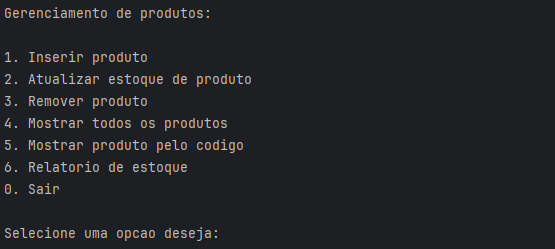
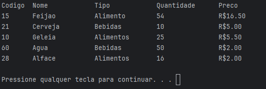
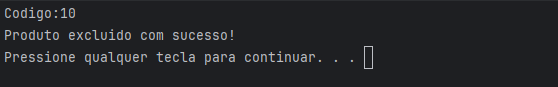

# Sistema de controle de estoque

Projeto simples feito para realizar um controle de estoque de supermercado, fazendo operações básicas como inserir produtos, atualizar quantidades em estoque, excluir produtos, dentre outras.

### 🔧 Tecnologias:

- Linguagem C

### 📸 Preview

